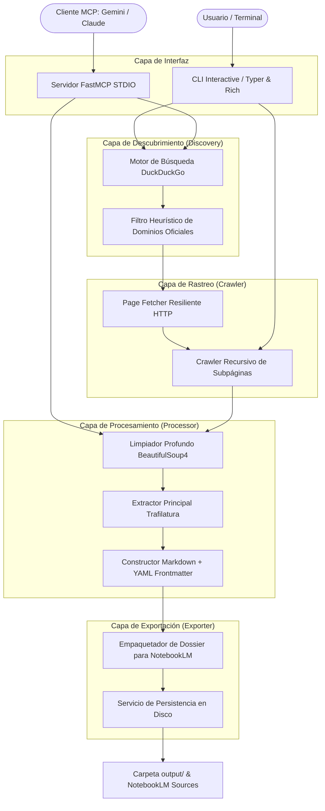
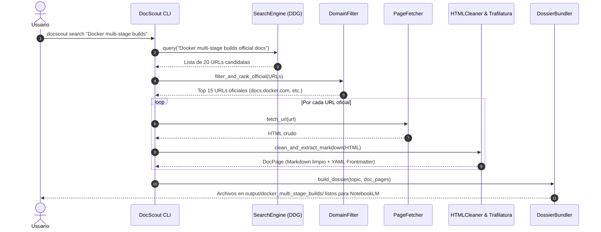
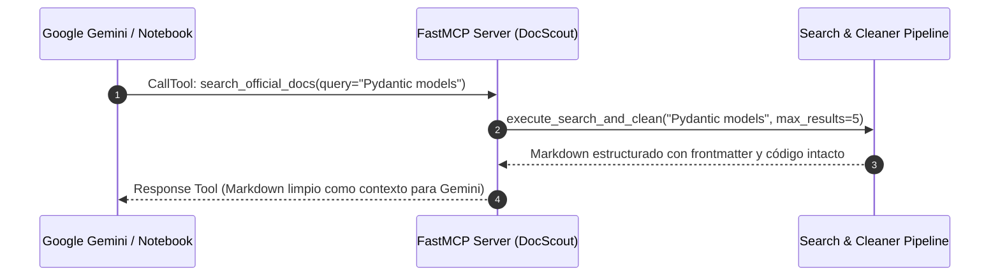

# 📐 Plan de Implementación Técnica (SDD): DocScout
**Código de Plan:** `PLAN-001-DOCSCOUT-ENGINEERING`  
**Versión:** 1.0.0  
**Especificación Asociada:** `SPEC-001-DOCSCOUT-BASE`  
**Estado:** Propuesta Técnica para Aprobación  
**Autor:** Antigravity AI  

---

## 1. Arquitectura del Sistema (El "Cómo")

DocScout sigue los principios de **Clean Architecture** y separación modular de responsabilidades. Cada capa tiene un propósito único e intercambiable.

### 1.1 Diagrama de Componentes y Flujo de Información



---

## 2. Esquemas de Datos Detallados (Data Contracts)

Todos los datos internos se validan mediante **Pydantic v2** para garantizar inmutabilidad, consistencia y tipado estricto.

### 2.1 Modelos del Núcleo (`src/docscout/core/models.py`)

```python
from datetime import datetime
from typing import Optional, List, Dict, Any
from pydantic import BaseModel, Field, HttpUrl

class OfficialSourceMetadata(BaseModel):
    """Metadatos canónicos de una fuente oficial extraída."""
    title: str = Field(..., description="Título canónico del documento o sección")
    source_url: str = Field(..., description="URL oficial de donde se extrajo el contenido")
    extracted_at: datetime = Field(default_factory=datetime.utcnow)
    domain: str = Field(..., description="Nombre de dominio oficial verificado")
    tech_stack: Optional[str] = Field(None, description="Tecnología o framework detectado")
    tags: List[str] = Field(default_factory=list, description="Etiquetas temáticas")
    word_count: int = Field(0, ge=0)

class DocPage(BaseModel):
    """Representa una página procesada y convertida a Markdown limpio."""
    metadata: OfficialSourceMetadata
    raw_html: Optional[str] = Field(None, exclude=True)
    clean_markdown: str = Field(..., description="Contenido limpio en Markdown sin ruido web")
    internal_links: List[str] = Field(default_factory=list, description="Enlaces a otras subpáginas de docs")

class SearchResultItem(BaseModel):
    """Resultado individual retornado por el motor de búsqueda."""
    title: str
    url: str
    snippet: str
    is_official_domain: bool = False
    confidence_score: float = Field(1.0, ge=0.0, le=1.0)

class CrawlConfig(BaseModel):
    """Configuración de límites y comportamiento del rastreador."""
    max_pages: int = Field(default=15, ge=1, le=100)
    max_depth: int = Field(default=2, ge=1, le=5)
    request_delay_seconds: float = Field(default=0.5, ge=0.1, le=5.0)
    timeout_seconds: int = Field(default=15, ge=3, le=60)
    user_agent: str = Field(default="DocScout/1.0 (Official Documentation Extractor for NotebookLM)")

class DossierManifest(BaseModel):
    """Manifiesto de salida para la carpeta exportada a Google NotebookLM."""
    topic: str
    generated_at: datetime = Field(default_factory=datetime.utcnow)
    total_sources: int
    total_words: int
    entry_point_file: str = "dossier_consolidado.md"
    sources_summary: List[Dict[str, Any]]
```

---

## 3. Flujo de Información Secuencial (Sequence Flows)

### 3.1 Flujo del Modo `search` (Búsqueda y Compilación)


### 3.2 Flujo del Modo `mcp` (Servidor para Gemini)


---

## 4. Desglose Detallado de Módulos e Implementación

### 4.1 `src/docscout/core/`
- **`config.py`**: Lista blanca inicial de más de 60 dominios oficiales populares (Python, FastAPI, Django, React, Vue, Docker, Kubernetes, AWS, GCP, Azure, Rust, Go, TypeScript, Tailwind, etc.) y patrones de expresiones regulares para identificar subdominios de documentación (`docs.*`, `*.dev`, `*.readthedocs.io`, `github.com/*/*`).
- **`models.py`**: Modelos Pydantic v2 documentados en la Sección 2.

### 4.2 `src/docscout/discovery/`
- **`search_engine.py`**: Integración con `duckduckgo_search` (usando `DDGS().text()`) con reintentos y soporte opcional para variables de entorno de Tavily/Google si están presentes.
- **`domain_filter.py`**: Algoritmo de puntuación de confianza para validar si una URL pertenece a la documentación oficial del creador/mantenedor de la tecnología.

### 4.3 `src/docscout/crawler/`
- **`page_fetcher.py`**: Cliente HTTP basado en `httpx` con headers de emulación de navegador estándar, timeouts robustos y pausas asíncronas para respetar rate limits.
- **`sitemap_crawler.py`**: Extractor de enlaces internos con soporte para análisis de sitemaps XML y deduplicación de URLs canónicas.

### 4.4 `src/docscout/processor/`
- **`html_cleaner.py`**: Limpieza previa con BeautifulSoup4 eliminando etiquetas ruidosas (`<nav>`, `<header>`, `<footer>`, `<aside>`, `<script>`, `<style>`, `<iframe>`, avisos de cookies y banners).
- **`markdown_builder.py`**: Extracción semántica con `trafilatura` y reconstrucción de bloques de código Markdown con su lenguaje e identación original, agregando el YAML frontmatter canónico.

### 4.5 `src/docscout/exporter/`
- **`dossier_bundler.py`**: Generador del archivo `dossier_consolidado.md` con:
  1. Portada y metadatos globales.
  2. Tabla de contenidos navegable con enlaces ancla.
  3. Capítulos organizados con separadores limpios.
- **`exporter_service.py`**: Persistencia en `./output/<topic_slug>/` con las subcarpetas `sources/` y el archivo `manifest.json`.

### 4.6 `src/docscout/mcp/`
- **`server.py`**: Servidor `FastMCP("DocScout")` exponiendo la herramienta:
  - `search_official_docs(query: str, max_results: int = 5) -> str`
- **`config_generator.py`**: Genera el snippet JSON listo para pegar en la configuración de Gemini Desktop, Antigravity o Claude Desktop.

### 4.7 `src/docscout/cli.py`
- Comandos implementados con `typer` y formateo enriquecido con `rich` (tablas, barras de progreso, paneles y colores).

---

## 5. Estrategia de Pruebas Unitarias y de Integración (QA)

| Archivo de Prueba | Objetivo |
| :--- | :--- |
| `tests/test_cleaner.py` | Verifica que el limpiador elimine scripts, avisos de cookies y mantenga intacto el código Python/JS. |
| `tests/test_discovery.py` | Verifica que el filtro de dominios priorice fuentes oficiales frente a blogs o sitios de spam. |
| `tests/test_exporter.py` | Verifica que el dossier unificado contenga la tabla de contenidos y el frontmatter YAML válido. |
| `tests/test_mcp_server.py` | Verifica que la herramienta MCP responda en formato estándar y sin excepciones. |

---

## 6. Siguientes Pasos de Ejecución (Tras Aprobación)

1. Crear el entorno virtual y el archivo `pyproject.toml` con las dependencias requeridas.
2. Implementar los módulos en orden de dependencia (`core` -> `discovery` -> `processor` -> `crawler` -> `exporter` -> `mcp` -> `cli`).
3. Ejecutar la suite de pruebas automatizadas con `pytest`.
4. Ejecutar validaciones de prueba reales y generar el primer dossier de documentación.
