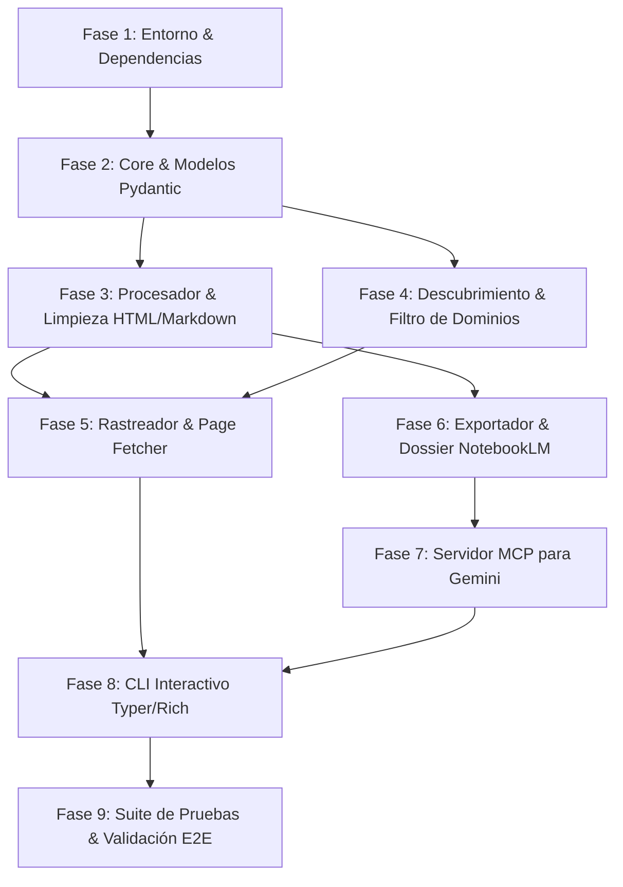

# 📝 Desglose de Tareas Granulares de Implementación (SDD): DocScout
**Código de Tareas:** `TASKS-001-DOCSCOUT`  
**Versión:** 1.2.0  
**Plan Asociado:** `PLAN-001-DOCSCOUT-ENGINEERING`  
**Especificación:** `SPEC-001-DOCSCOUT-BASE`  
**Estado:** ✅ 100% Implementado y Verificado E2E  
**Autor:** Antigravity AI  

---

## 🎯 Resumen de Fases y Dependencias Secuenciales



---

## 📋 Tareas Granulares de Implementación con Trazabilidad [REQ-XX]

### Fase 1: Inicialización del Entorno y Dependencias
- [x] **TASK-1.1**: Crear estructura de directorios del proyecto (`src/docscout/{core,discovery,crawler,processor,exporter,mcp}`, `tests/`, `output/`).
- [x] **TASK-1.2**: Crear `pyproject.toml` y `requirements.txt` con las dependencias fijadas (`typer`, `rich`, `beautifulsoup4`, `trafilatura`, `lxml`, `duckduckgo_search`, `httpx`, `pydantic>=2.0`, `fastmcp>=0.1.0`, `pytest`, `pytest-asyncio`).
- [x] **TASK-1.3**: Configurar archivos `__init__.py` en cada paquete para habilitar importaciones modulares.
  - *Verificación:* `python -c "import docscout"` ejecuta sin advertencias ni errores.

---

### Fase 2: Capa Core y Modelos de Datos
- [x] **TASK-2.1**: Implementar `src/docscout/core/models.py` con los modelos Pydantic v2:
  - `OfficialSourceMetadata` (título, URL, fecha, dominio oficial, etiquetas, recuento de palabras).
  - `DocPage` (modelo de página procesada con Markdown limpio e hipervínculos internos).
  - `SearchResultItem` (resultado de búsqueda con puntuación de confianza).
  - `CrawlConfig` (límites de seguridad: `max_pages`, `max_depth`, `request_delay_seconds`).
  - `DossierManifest` (metadatos del lote para NotebookLM).
  - `SearchDocsInput` (esquema de entrada para herramientas MCP).
- [x] **TASK-2.2**: Implementar `src/docscout/core/config.py` con:
  - Catálogo de +60 dominios oficiales verificados (Python, FastAPI, Docker, React, AWS, GCP, etc.).
  - Expresiones regulares para detección de documentación (`docs.*`, `*.dev`, `*.readthedocs.io`, `github.com/*/*`).
  - Constantes operacionales (`DEFAULT_MAX_PAGES = 15`, `DEFAULT_DELAY = 0.5s`, `DEFAULT_TIMEOUT = 15s`).
  - *Verificación:* Pruebas de instanciación y validación de tipos Pydantic.

---

### Fase 3: Procesador de Contenido y Limpieza Quirúrgica `[REQ-03]`
- [x] **TASK-3.1**: Implementar `src/docscout/processor/html_cleaner.py`:
  - Algoritmo BeautifulSoup4 para remover tags ruidosas (`<nav>`, `<header>`, `<footer>`, `<aside>`, `<script>`, `<style>`, `<iframe>`, avisos de cookies, botones de feedback).
  - Extractor y aislador del contenedor semántico principal (`<main>`, `<article>`, `#content`, `.docs-content`).
  - *Mitigación de Calidad 2:* Protección estricta de contenedores `<pre><code>` y `<table>` antes del stripping.
- [x] **TASK-3.2**: Implementar `src/docscout/processor/markdown_builder.py`:
  - Conversión a Markdown enriquecido con Trafilatura preservando bloques de código ` ```lenguaje ` e identación intacta.
  - Generador de encabezados YAML frontmatter canónicos (título, fuente oficial, timestamp, tags) optimizados para NotebookLM.
- [x] **TASK-3.3**: Crear `tests/test_cleaner.py` con fixtures HTML reales de prueba.
  - *Verificación:* `pytest tests/test_cleaner.py` validando remoción de scripts y preservación de código.

---

### Fase 4: Descubrimiento y Filtro de Fuentes Oficiales `[REQ-01]`
- [x] **TASK-4.1**: Implementar `src/docscout/discovery/domain_filter.py`:
  - Algoritmo de validación de dominios oficiales con cálculo de puntuación de confianza (`confidence_score`).
  - Descarte automático de sitios agregadores de anuncios o contenido de baja calidad.
- [x] **TASK-4.2**: Implementar `src/docscout/discovery/search_engine.py`:
  - Integración con `duckduckgo_search` para búsquedas 100% gratuitas sin API keys obligatorias.
  - Generación de operadores de búsqueda técnica especializados.
- [x] **TASK-4.3**: Crear `tests/test_discovery.py`.
  - *Verificación:* `pytest tests/test_discovery.py` verificando que consultas sobre Docker o FastAPI retornen URLs oficiales prioritarias.

---

### Fase 5: Rastreo y Descarga Resiliente (Crawler) `[REQ-02]`
- [x] **TASK-5.1**: Implementar `src/docscout/crawler/page_fetcher.py`:
  - Cliente HTTP asíncrono/síncrono con `httpx` (User-Agent identificable, reintentos exponenciales y manejo de errores 403/404/429).
  - *Mitigación de Calidad 2:* Pausas forzadas de rate limit (`request_delay_seconds=0.5s`) entre peticiones para no saturar servidores.
- [x] **TASK-5.2**: Implementar `src/docscout/crawler/sitemap_crawler.py`:
  - Extractor de enlaces internos con restricción estricta al mismo host/subdominio de la documentación.
  - Control de profundidad (`max_depth`) y límite de páginas (`max_pages`) con conjunto en memoria `visited_urls`.
  - *Verificación:* Pruebas de rastreo controlado contra URLs de documentación públicas.

---

### Fase 6: Capa de Exportación para Google NotebookLM `[REQ-04]`
- [x] **TASK-6.1**: Implementar `src/docscout/exporter/dossier_bundler.py`:
  - Generador de `dossier_consolidado.md` con:
    1. Portada con metadatos globales de la tecnología.
    2. Tabla de contenidos (TOC) navegable con anclas a cada sección.
    3. Capítulos organizados y numerados.
- [x] **TASK-6.2**: Implementar `src/docscout/exporter/exporter_service.py`:
  - Creación de la estructura en `output/<topic_slug>/` con las subcarpetas `sources/` (archivos `.md` individuales) y `manifest.json`.
- [x] **TASK-6.3**: Crear `tests/test_exporter.py`.
  - *Verificación:* `pytest tests/test_exporter.py` comprobando la integridad del dossier y el schema del manifest.

---

### Fase 7: Servidor MCP (Model Context Protocol) para Google Gemini `[REQ-05]`
- [x] **TASK-7.1**: Implementar `src/docscout/mcp/server.py`:
  - Instancia `FastMCP("DocScout")` exponiendo la herramienta:
    - `@mcp.tool() search_official_docs(query: str, max_results: int = 5) -> str`
  - *Mitigación de Calidad 2:* Protocolo STDIO estándar compatible con JSON-RPC 2.0 (Gemini, Antigravity, Claude).
- [x] **TASK-7.2**: Implementar `src/docscout/mcp/config_generator.py`:
  - Generador de plantilla `mcp_config.json` con el comando exacto para enlazar en 1 clic con clientes MCP.
- [x] **TASK-7.3**: Crear `tests/test_mcp_server.py`.
  - *Verificación:* `pytest tests/test_mcp_server.py` validando la ejecución de la herramienta MCP.

---

### Fase 8: CLI Interactivo (Typer + Rich) `[REQ-06]`
- [x] **TASK-8.1**: Implementar `src/docscout/cli.py` con los comandos:
  - `docscout search "<término>"`
  - `docscout crawl "<url_raíz>"`
  - `docscout mcp` (arranca el servidor STDIO)
  - `docscout interactive` (asistente con menús Rich interactivos)
- [x] **TASK-8.2**: Configurar `src/docscout/__main__.py` para ejecución con `python -m docscout`.
  - *Verificación:* `python -m docscout --help` muestra la ayuda completa y estilizada.

---

### Fase 9: Verificación Integral (E2E) y Documentación
- [x] **TASK-9.1**: Ejecutar suite completa `pytest tests/ -v`.
- [x] **TASK-9.2**: Ejecutar una prueba real de extremo a extremo:
  - `python -m docscout search "Docker multi-stage builds" --max-results 3`
  - Validar los archivos generados en `output/docker-multi-stage-builds/`.
- [x] **TASK-9.3**: Crear `README.md` con manual de instalación, comandos CLI y guía para importar las fuentes en Google NotebookLM / Gemini.

---

## 🔒 Guardrail SDD
> **REGLA DE ORO:** Ningún archivo de código fuente (`.py`) se escribirá hasta que el usuario apruebe formalmente este plan de tareas auditado.
